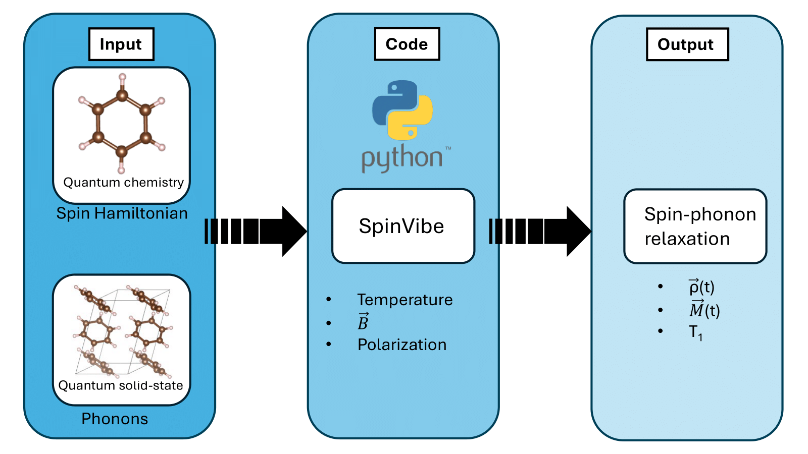

[](https://joss.theoj.org/papers/6cd884ec29554707741cd8e700542a68)
[](https://github.com/victorchanglee/SpinVibe/releases)
[](https://victorchanglee.github.io/SpinVibe/)


# SpinVibe

`SpinVibe` is a Python package for simulating spin-phonon coupling and
calculating $T_1$ of molecular qubits in a crystal lattice from
first-principles calculations. This is achieved by connecting periodic
lattice dynamics and molecular electronic structure calculations. In
addition, `SpinVibe` enables the parametric analysis of $T_1$ under
different factors, including temperature, crystal/molecule orientation
and applied magnetic fields. The code is written in Python3 and is
MPI-parallelized over phonon modes and $q$-points using `mpi4py`.


Please take a look at the  [Documentation](https://victorchanglee.github.io/SpinVibe/)





---

## Inputs
- Solid-state phonons and eigenvectors
- Molecular Spin-Hamiltonian parameters (e.g. g-factor, zero-field splitting tensor)
- Parameters: Temperature, Polarization, external magnetic field, etc.

## Output
- Time evolution of the spin density and magnetization
- Spin-phonon relaxation time (T1)

---

## Requirements
The code was written using the following Python Libraries:

- python                    3.9.21
- numpy                     1.26.4
- scipy                     1.13.1
- h5py                      3.12.1
- mpi4py                    4.0.2 (optional for MPI parallelization)

## SpinVibe Installation Guide

### Step 1: Download Source Code

Download SpinVibe source code using the command:

```bash
git clone https://github.com/victorchanglee/SpinVibe.git
```

---

### Step 2: Navigate to Root Directory

```bash
cd SpinVibe
```

---

### Step 3: Installation

Install the code with the command:

```bash
pip install -e .
```

Optionally, the code is parallelize over MPI using the mpi4py library. If MPI parallelization is available you can use

```bash
pip install -e ".[mpi]" 
```

Once the installation is succesful, you can test it using the files provided in the test directory.

## Example

An example is included in the test directory. To run the example just run

```bash
spinvibe input.json
```

The expected output for a serial run is in test.out.

Additionally, a Jupyter Notebook Ttutorial is included inside the test directory.

## Contributing and Support

Please use the [Issue Tracker](https://github.com/victorchanglee/SpinVibe/issues) to report bugs or request new features.  
Contributions are also welcome! Please use the Pull Request and Fork workflow to contribute.

## Contact

For questions or collaboration, please email: victor.changlee@northwestern.edu or jrondinelli@northwestern.edu
