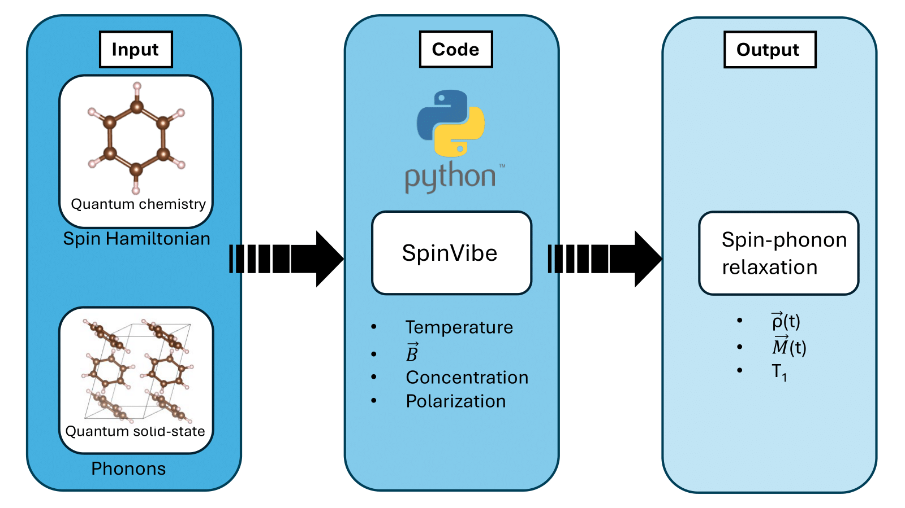

# Summary 

Molecular qubits have emerged as versatile candidates for quantum
information technologies. Their appeal lies in the chemical tunability,
the possibility of large-scale synthetic control and their integration
with solid-state and solution-phase
architectures.[@Bayliss2022; @Wojnar2024] In contrast to solid-state
defects or superconducting qubits, molecular qubits can be engineered at
the atomic level, allowing researchers to systematically tailor their
electronic, magnetic, and vibrational properties.[@Laorenza2022]
However, the practical implementation of molecular qubits is limited by
decoherence and relaxation processes, which shorten the time window over
which quantum information can be stored and manipulated.

Relaxation dynamics fundamentally determine the practical utility of
molecular qubits. The spin--spin relaxation time $T_2$ establishes the
maximum duration for quantum information storage and directly limits the
achievable sensitivity in sensing applications. Simultaneously, the
spin--lattice relaxation time $T_1$ governs vibrationally mediated
decoherence processes and determines how long the molecular spin can
maintain its initialized state before it returns to thermal equilibrium
after excitation. Critically, short $T_1$ values impose additional
constraints on $T_2$, creating interdependent relationships that must be
carefully managed through molecular design.[@Warner2013; @Mullin2024]
$T_1$ is limited by the coupling of electronic spins with lattice
vibrations, commonly known as phonons.[@Laorenza2021] This spin--phonon
coupling governs energy exchange between the spin system and the
vibrational bath, providing the dominant relaxation pathway in many
molecular crystals.

Depending on the phonon spectrum and the local molecular environment,
different mechanisms such as the ($i$) direct processes, ($ii$) Raman
processes, and ($iii$) Orbach relaxation can contribute to
$T_1$.[@abragam2012electron] Recent experimental and theoretical efforts
have highlighted how molecular structure, ligand field symmetry, and
host lattice dynamics dictate the magnitude and anisotropy of
spin--phonon coupling.[@Lunghi2020; @Bayliss2022; @Laorenza2022]

`SpinVibe` is a Python package for simulating spin-phonon coupling and
calculating $T_1$ of molecular qubits in a crystal lattice from
first-principles calculations. This is achieved by connecting periodic
lattice dynamics and molecular electronic structure calculations. In
addition, `SpinVibe` enables the parametric analysis of $T_1$ under
different factors, including temperature, crystal/molecule orientation
and applied magnetic fields. The code is written in Python3 and is
MPI-parallelized over phonon modes and $q$-points using `mpi4py`.

*Figure 1: Schematic representation of the SpinVibe framework. The spin Hamiltonian, derived
from quantum chemistry calculations, and the phonon modes, obtained from quantum solid-state
simulations, are merged within SpinVibe to compute spin–phonon relaxation dynamics and T1
under various enironmental factors.*

# Statement of need 

Computational approaches based on density functional theory (DFT) have
proven to be valuable for analyzing phonon modes and lattice dynamics in
molecular systems.[@baroni2001] Complementarily, multiconfigurational
electronic structure methods, such as CASSCF combined with NEVPT2,
provide an accurate description of the spin states and their energy
splittings, which are essential for modeling qubit
performance.[@Janicka2022; @Baldinelli2025] Integrating these two
perspectives into a unified framework for simulating spin--phonon
coupling enables a microscopic understanding of the relaxation
mechanisms in molecular qubits. Such an approach represents a powerful
tool for the rational design of next-generation molecular qubits, with
the potential to accelerate the discovery of systems that exhibit
long-lived spin states.

To this end, we developed `SpinVibe`, a Python package that is designed
to be user-friendly, providing streamlined workflows that are readily
adapted to any *ab initio* code. Since it only requires the storage of
minimal data from first-principles calculations as `NumPy` arrays in
HDF5 files, it is not restricted to specific codes. Any ab-initio
package can be used to generate the input data, provided that the
relevant quantities are extracted and saved in this format.

# First principles spin-phonon coupling 

Our code implements the theoretical framework developed by Lunghi and
Sanvito[@Lunghi2020; @lunghi2022; @Lunghi2023], where in the
weak-coupling regime the interaction between the spin Hamiltonian and
the phonons is expanded as a Taylor series truncated at the quadratic
term:

$$
\hat{H}_{sph} = \sum_{\alpha q} \left( \frac{\partial \hat{H}_s}{\partial Q_{\alpha q}} \right) \hat{Q}_{\alpha q}(t) + \sum_{\alpha q} \sum_{\beta q'} \left( \frac{\partial^2 \hat{H}_s}{\partial Q_{\alpha q} \partial Q_{\beta q'}} \right) \hat{Q}_{\alpha q}(t) \hat{Q}_{\beta q'}(t)
$$

In [\[eq:1\]](#eq:1){reference-type="ref+label"
reference="eq:1"}, the first order term represents the interaction of
the spin with a single phonon $Q_{\alpha q}$. The second order term
describes the interaction of the spin with two phonons $Q_{\alpha q}$
and $Q_{\beta q'}$.

To describe the time evolution of the system, we employ the secular
Redfield equation under the the Born-Markov approximation

$$
\frac{\partial \rho^{s}_{ab} (t)}{\partial t} = \sum_{cd} e^{i(\omega_{ac} + \omega_{db})t} R_{ab,cd} \rho^{s}_{cd} (t)\
$$

where $R_{ab,cd}$ denotes the Redfield superoperator. The single-phonon
contribution to the Redfield tensor, under the secular approximation, is

$$
R^{1-ph}_{ab,cd} = -\frac{\pi}{2 \hbar^2} \sum_{\alpha}  \sum_{j} \delta_{bd} V^{\alpha}_{aj} V^{\alpha}_{jc} G^{1-ph}(\omega_{jc}, \omega_{\alpha})
$$
$$
-V^{\alpha}_{ac} V^{\alpha}_{db} G^{1-ph}(\omega_{ac}, \omega_{\alpha})
-V^{\alpha}_{ac} V^{\alpha}_{db} G^{1-ph}(\omega_{bd}, \omega_{\alpha})
+ \sum_{j} \delta_{ca} V^{\alpha}_{dj} V^{\alpha}_{jb} G^{1-ph}(\omega_{jd}, \omega_{\alpha}) 
$$

where $V^{\alpha} = \left( \frac{\partial \hat{H}_s}{\partial Q_{\alpha}} \right)$ and

\begin{equation}
G^{1\text{--ph}}(\omega_{ij}, \omega_{\alpha q})
= \frac{1}{\pi} \left[
\frac{\Delta_{\alpha q}}{\Delta_{\alpha q}^{2} + (\omega_{ij} - \omega_{\alpha q})^{2}} \, \bar{n}_{\alpha q}
+ \frac{\Delta_{\alpha q}}{\Delta_{\alpha q}^{2} + (\omega_{ij} + \omega_{\alpha q})^{2}} \, (\bar{n}_{\alpha q}+1)
\right]
\end{equation}

is the phonon correlation function in the presence of
anharmonic terms that leads to a decay in the phonon lifetime with a
rate $\Delta_{\alpha q}$.

The two-phonon contribution is given by

\begin{equation}
R^{2\text{--ph}}_{ab,cd} = -\frac{\pi}{4 \hbar^2}  \sum_{\alpha \geq \beta } 
\Bigg\{  \sum_j  \delta_{bd} V^{\alpha \beta}_{aj} V^{\alpha \, \beta }_{jc} 
G^{2\text{--ph}}(\omega_{jc}, \omega_{\alpha }, \omega_{\beta})
 - V^{\alpha \beta }_{ac} V^{\alpha \, \beta }_{db}  G^{2\text{--ph}}(\omega_{ac}, \omega_{\alpha}, \omega_{\beta})
 \end{equation}
 \[ - V^{\alpha \beta }_{ac} V^{\alpha \, \beta }_{db} G^{2\text{--ph}}(\omega_{bd}, \omega_{\alpha },\omega_{\beta }) + \sum_j  \delta_{ca} V^{\alpha \beta}_{dj} V^{\alpha \, \beta}_{jb} G^{2\text{--ph}}(\omega_{jd}, \omega_{\alpha}, \omega_{\beta}) \Bigg\}
\]

where $V^{\alpha \beta} = \left( \frac{\partial^2 \hat{H}_s}{\partial Q_{\alpha} \partial Q_{\beta}} \right)$ and

\begin{equation}
G^{2\text{--ph}}(\omega_{ij},\omega_{\alpha q},\omega_{\beta q'})
= \frac{1}{\pi} \Bigg[
\frac{\Delta_{\alpha q \beta q'}}{\Delta_{\alpha q \beta q'}^{2}
+ (\omega_{ij} - \omega_{\alpha q} - \omega_{\beta q'})^{2}}
\bar{n}_{\alpha q}\bar{n}_{\beta q'}
 \end{equation}
\[
+\frac{\Delta_{\alpha q \beta q'}}{\Delta_{\alpha q \beta q'}^{2} + (\omega_{ij} + \omega_{\alpha q} + \omega_{\beta q'})^{2}}
(\bar{n}_{\alpha q}+1)(\bar{n}_{\beta q'}+1)
\]
\[
+\frac{\Delta_{\alpha q \beta q'}}{\Delta_{\alpha q \beta q'}^{2} + (\omega_{ij} - \omega_{\alpha q} + \omega_{\beta q'})^{2}}
\bar{n}_{\alpha q}(\bar{n}_{\beta q'}+1)
\]
\[
+\frac{\Delta_{\alpha q \beta q'}}{\Delta_{\alpha q \beta q'}^{2} + (\omega_{ij} + \omega_{\alpha q} - \omega_{\beta q'})^{2}}
(\bar{n}_{\alpha q}+1)\bar{n}_{\beta q'}
\Bigg]\,.
\]

Once the time-evolution is performed, we can study the time-evolution of
the magnetization of the system

$$\vec{M}(t) = \text{Tr} (\vec{S} \hat{\rho} (t))$$

from which the $T_1$ can be extracted by fitting the decay to

$$M_z(t) = \big[ M_z(t=0) - M_z^{\mathrm{eq}} \big] e^{-t/T_1} + M_z^{\mathrm{eq}}\,.$$

# Acknowledgments
This material is based upon work supported by the U.S. Department of
Energy, Office of Science, Office of Basic Energy Sciences under Award
Number DE-SC0025176. Code development was supported by in part through
the computational resources and staff contributions provided for the
Quest high performance computing facility at Northwestern University
which is jointly supported by the Office of the Provost, the Office for
Research, and Northwestern University Information Technology. This work
used Anvil at Purdue University through allocation PHY-250069 from the
Advanced Cyberinfrastructure Coordination Ecosystem: Services & Support
(ACCESS) program, which is supported by U.S. National Science Foundation
grants #2138259, #2138286, #2138307, #2137603, and #2138296.
V. C. L. thanks L. A. Mariano and A. Lunghi for the helpful discussions.

We acknowledge contributions from Brigitta Sipocz, Syrtis Major, and Semyeong
Oh, and support from Kathryn Johnston during the genesis of this project.

# References
